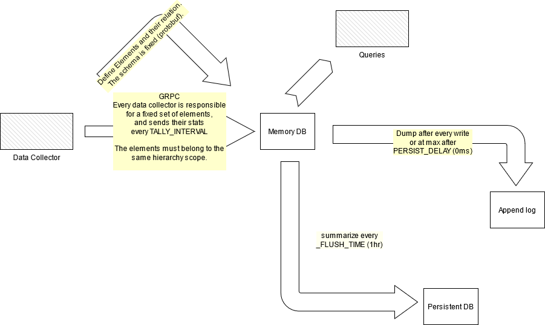

# meteriot
A lighgweight and fast TSDB in rust.
Meters + Umbrellas un Heb.

# Objectives
* Very fast inserts (updates and deletes don't matter).
* Fast queries. But not at expense of inserts!
* Lightweight
* Very high cardinality.
* Scale up, not out. It is intended to be embedded into
projects, not as a standalone product.
* Fixed, pre-defined, and potentially even pre-compiled
schema. It should be custom fit compiled per useage.
* Optimized for bulk inserts.
* A handful of writers, many readers.

# Non Objectives
* Storage space efficiency. Yet it should not be a hog.
* Multi protocol, multi purpose.
* Scale out. Only scale up.
* Replication. Rely on storage resiliency and 3rd
party tools

# Technicalities
## Rust for highly optimised code

## GRPC for input inputs
* Is grpc serialisation / deserialisation a good choice?
* Over quic (HTTP/3) or simple tcp? Can quic help in case of big binary files?

## Indexes and tags in sqlite

## Output to a standard SQL/ES DB
* No need to invent or impleent a query language
* Out of the box integration with other tools, such as Grafana.

# Design

 <a href="https://app.diagrams.net/?mode=github#Hshohamlevy%2Fmeteriot%2Fmain%2Fimages%2Farch_overview.png">Edit</a>

## Polled System Decription
### Hierarchy and Scopes
A system is made of different element types. An element can be a scope or a leaf. The only difference between a scope and a leaf is that a scope may have child elements, and a leaf may not.

### Schema (elements and metrics)
The schema of the TSDB is fixed, defined at compile time by the PROTOBUF.

